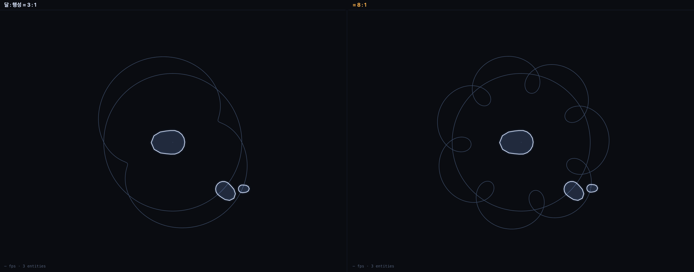

# 001 · 조석 고정 — 자전이 공전과 1회로 맞을 때

`earth` · `loop` · 2026-08-23

```
Orbit(spin:rev)@entity[sun] + Orbit(spin:rev)@entity[planet] + Orbit(spin:rev)@entity[moon←planet]
https://kinesynth.vercel.app/?demo=orbit&trail=1
```



## 원리 한 줄

한 몸이 두 주기를 산다 — 제자리 돎과 큰 원 돎이 겹친다.

## 확인한 것

`Orbit`의 `spin`을 **공전 1회당 자전수**로 정의하면 `spin = 1`이 곧 조석 고정이 된다.
달의 코(로컬 +x)가 바깥을 향하는 방향과 실제 바깥 방향의 각도 차를 900스텝(15초) 동안 쟀다.

| | spin | 코와 바깥 방향의 최대 어긋남 |
|---|---|---|
| 달 | 1 | **0.00°** — 같은 면이 늘 중심을 향한다 |
| 행성 | 7 | 180° — 계속 돈다 |

정의만으로 성립하는 게 핵심이다. 조석 고정을 따로 구현하지 않았다.
`rot = 2π(spin·rev·t + phase)`이고 `θ = 2π(rev·t + phase)`이므로 `spin = 1`이면 `rot ≡ θ`다.

## 눈에 보이는 것

세계 좌표에서 본 달의 궤적은 **원 위의 원**(에피트로코이드)이다. 두 주기의 비가 고리 수를 정한다 —
위 그림 왼쪽이 3:1, 오른쪽이 8:1.

```
https://kinesynth.vercel.app/?demo=orbit&trail=1&p=orbit@moon.rev:0.15   3 : 1
https://kinesynth.vercel.app/?demo=orbit&trail=1&p=orbit@moon.rev:0.4    8 : 1
```

## 합성 메모

이 장면은 **코어 하나를 세 번 걸어** 만들었다. 새 코어가 필요한 게 아니라 라우팅이 필요했다.
`sun`은 반지름 0의 궤도(제자리 자전), `planet`은 화면 중심을 돌고, `moon`은 앵커로 `planet`을 돈다.
파라미터는 패치 key(`orbit@moon`)로 갈린다.

## 이어지는 질문

- 균일 각속도의 원이다. 케플러의 면적속도(타원·근일점 가속)를 넣으면 같은 그림이 어떻게 일그러지나 — 별도 코어의 몫.
- 지구의 태양일이 항성일보다 4분 긴 것도 같은 중첩이다. `spin`을 366:365로 두면 그 4분이 보이나.
