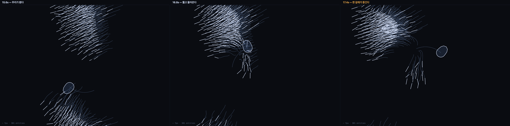

# 002 · 장면이 코어를 부른다 — 포식자 산개

`bio` · `event` · 2026-08-24

```
Flee(거리→회피)@flock[bird←hunter] + Boids(분리·정렬·응집)@flock[bird] + Orbit(spin:rev)@entity[hunter] + Elastic(vel→stretch)@deform[bird] ×exa1.8
https://kinesynth.vercel.app/?demo=scene-hunt
```



## 왜 이걸 먼저 만들었나

"16칸 매트릭스를 채운다"가 아니라 **"장면을 하나 만든다"**로 시작했다. 그랬더니
필요한 코어가 따라왔다 — 라우팅만으로는 회피라는 *행동*이 생기지 않았고,
`Flee`가 필요했다. 그리고 그 코어가 마침 비어 있던 `flock × event` 칸이었다.

> 장면이 정해지면 필요한 코어가 따라온다. 반대가 아니다.

칸을 보고 코어를 만들었으면 `flock × event`에 무엇을 넣을지 한참 고민했을 것이다.
장면에서 출발하니 답이 이미 정해져 있었다.

## 확인한 것 · 구멍은 열린다

포식자 반경(150px) 안의 새 수를 900스텝 동안 셌다.

| 도피 세기 | 반경 안 평균 | 최근접 거리 |
|---|---|---|
| 0 | 111.5마리 | **0px** — 포식자가 무리를 그냥 통과한다 |
| 1700 | 22.4마리 (중앙값 7) | **77px** — 구멍이 열린다 |

## 잘못 짚었던 것 · 포식자가 새보다 느렸다

처음엔 포식자를 `rev 0.09`로 뒀다. 궤도 속도 **74px/s** — 새(150px/s)의 절반이다.
그래서 무리가 궤도 전체를 미리 비워 버렸고, 그림은 "지나갔다 메워진다"가 아니라
**"영역을 피한다"**가 됐다. 수치상 산개는 성립했는데(반경 안 4마리) 장면이 틀린 것이다.

포식자를 **232px/s**로 올리자 무리가 미처 피하지 못하고 뚫린다.
320px 안의 새 수가 3 ~ 295로 출렁이는 게 그 증거다 — 들어왔다 나간다는 뜻.

> 수치가 맞아도 장면이 틀릴 수 있다. 산개의 크기가 아니라 **산개의 타이밍**이 이야기를 만든다.

## 라우팅이 필요했던 또 한 곳

`Elastic`을 전체에 걸면 포식자에서 `Orbit`(rot set)과 부딪힌다 — 엔진이 경고한다.
`[bird]`에만 걸어 풀었다. 소유 규칙이 장면을 만드는 도중에 실제로 한 번 더 일했다.

## 이어지는 질문

- 도피가 **전파**되지 않는다. 실제 찌르레기 군무에서는 회피가 파동으로 번진다
  (Procaccini et al. 2011). 지금은 반경 안의 새만 반응한다 — 이웃에게 `sig.flee`를
  넘기는 규칙을 더하면 파동이 생길까.
- 포식자가 쫓지 않는다. 정해진 궤도를 돌 뿐이다. 무리의 무게중심을 향하는 `Seek`이
  있으면 사냥이 되는데, 앵커가 엔티티 하나만 가리켜서 무게중심을 못 준다 — 라우팅의 다음 층위.
