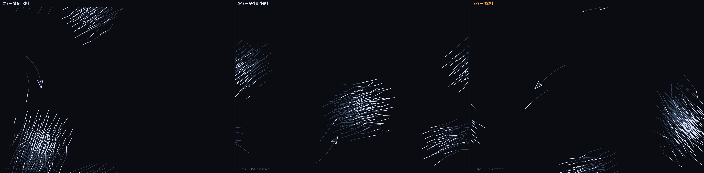

# 003 · 앵커가 그룹을 가리킬 때 — 사냥

`bio` · `event` · 2026-08-24

```
Flee(거리→회피)@flock[bird←hunter] + Boids(분리·정렬·응집)@flock[bird] + Seek(가장 가까운 것→요격)@entity[hunter←bird] + Elastic(vel→stretch)@deform[bird] ×exa1.8
https://kinesynth.vercel.app/?demo=scene-chase
```



## 막혀 있던 것

앵커는 늘 **엔티티 하나**였다. 체인의 뿌리(`Spring[tail←ball]`), 공전의 중심
(`Orbit[moon←planet]`), 피할 대상(`Flee[bird←hunter]`) — 전부 하나면 됐다.

그런데 **추격**은 다르다. 매는 무리를 쫓는다. 무리 전체를 봐야 그중 가장 가까운 하나를
고를 수 있다. `ctx.anchor`가 첫 하나만 주는 한 사냥은 만들 수 없었다.

## 뚫은 방법

```ts
interface StepCtx {
  anchor?: Entity;    // 하나면 되는 코어용 (지금까지)
  anchors: Entity[];  // 그룹을 참조하는 코어용 (새로)
}
```

`anchor`는 `anchors[0]`이다. 기존 코어 셋은 한 글자도 안 고쳤다.

**같이 고친 것**: 앵커 해석이 매 스텝 `world.entities.find(...)`로 전체를 훑고 있었다 —
관문 1에서 대상에는 캐시를 걸어 놓고 앵커는 빠뜨린 것이다. 대상과 같은 규칙으로 묶었다
(`world.rev`가 바뀔 때만 재검색). 무리 크기를 실시간으로 바꿔도 캐시가 따라온다.

## 잘못 짚었던 것 · 새가 너무 많아서 놓칠 수가 없었다

첫 시도는 무리 260마리였다. 12가지 설정을 다 재 봐도 **"시도 1회"** — 포식자가 한 번 붙으면
40초 내내 안 떨어졌다. 원인은 밀도였다: 260마리가 토러스에 퍼져 있으면 어디를 가도
*누군가*는 가까이 있다. 포식자가 놓칠 방법이 없다.

무리를 **150마리로 줄이고 응집을 2.2로 올려** 하나의 덩어리로 뭉치자 리듬이 생겼다.

| 무리 | 시도(40초) | 무게중심까지 거리 p10~p90 | 무리 퍼짐 |
|---|---|---|---|
| 260마리 · 응집 1.7 | **1회** | 86 ~ 230px | 230px |
| 150마리 · 응집 2.2 | **6회** | 108 ~ 377px | 68px |

> 놓치려면 먼저 무리가 **하나의 덩어리**여야 한다. 흩어져 있으면 놓칠 대상 자체가 없다.

## 요격이 만드는 것

`lead`(예측 시간)는 지금 자리가 아니라 `pos + vel·lead`를 향하게 한다. 그래서 포식자가
모퉁이를 질러간다. 동시에 `turn`(선회 응답)이 한계라서 급선회하는 무리는 놓친다 —
**앞질러 가는 능력과 꺾이는 한계가 같이 있어야 시도가 반복된다.** 하나만 있으면
영영 붙어 있거나(요격만) 영영 못 붙는다(선회만).

## 이어지는 질문

- 포식자가 여럿이면 비용이 O(먹이 × 포식자)다. 무리가 아주 커지면 격자 인덱스가 필요하다 —
  라이프 게임에서 어차피 만들 것이니 그때 같이 쓴다.
- 도피가 아직 **전파되지 않는다**. 반경 안의 새만 반응한다. 이웃에게 `sig.flee`를 넘기면
  파동이 생길까 — `Flee`는 이미 `sig.flee`(0~1)를 남기고 있으니 읽을 코어만 있으면 된다.
