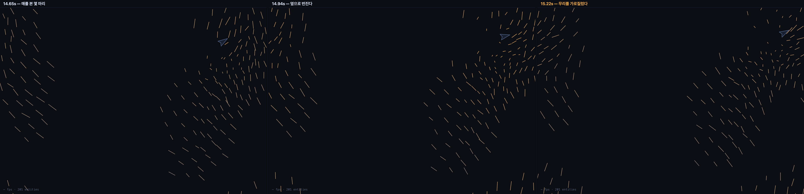

# 004 · 공포는 개체보다 빨리 번진다

`bio` · `event` · 2026-08-24

```
Flee(거리→회피)@flock[bird←hunter] + Panic(이웃→전파)@flock[bird] + Boids(분리·정렬·응집)@flock[bird] + Seek(가장 가까운 것→요격)@entity[hunter←bird] + Elastic(vel→stretch)@deform[bird] ×exa1.8
https://kinesynth.vercel.app/?demo=panic-wave
```



## 원리 한 줄

옆이 튀면 따라 튄다 — 그래서 공포가 개체보다 빨리 번진다.

## 확인한 것 · 파동은 새보다 10배 빠르다

`Panic`은 이웃의 겁을 `gain`배로 받아 `rise` 속도로 올린다. 한 홉 건너는 데 걸리는 시간이
곧 파동 속도다: **전파 반경 × rise**.

| rise | 파동 속도 | 새 속도(150px/s) 대비 |
|---|---|---|
| 6 | 570px/s | 3.8배 |
| **16** | **1520px/s** | **10.1배** |
| 40 | 3800px/s | 25.3배 |

실제 찌르레기 군무의 회피파는 새보다 **10~20배** 빠르다 (Procaccini et al. 2011).
`rise 16`이 그 자리에 있다.

## 확인한 것 · 몇 마리가 전체를 움직인다

`gain`은 한 홉 건널 때마다 남는 비율이다. 이걸 끄면 전파가 사라진다.

| gain | 위협을 **직접 본** 새 | **겁먹은** 새 | 배율 |
|---|---|---|---|
| 0 | 9.3마리 | 14.9마리 | 1.6배 |
| 0.5 | 15.2마리 | 48.0마리 | 3.2배 |
| **0.88** | **5.2마리** | **56.9마리** | **10.9배** |

정점에서는 **2마리가 본 것이 220마리를 움직였다.** 무리는 위협을 각자 보고 반응하지 않는다.

## 신호를 눈으로 보는 장치

파동은 정지 화면에서 보이지 않는다. 위치는 그대로고 **속성**만 번지기 때문이다.
그래서 뷰어에 「신호 보기」를 넣었다 — `sig` 채널 값(0~1)으로 엔티티를 물들인다.
차가움 0 → 뜨거움 1.

목록은 **코어의 `writes` 선언에서 나온다.** `sig.`로 시작하는 채널을 모으면 그게 곧
"지금 이 스택에서 볼 수 있는 신호"다. 소유 규칙을 위해 적어 둔 선언이 또 한 번 일했다 —
Lissajous를 열면 선택기 자체가 없고, Bounce를 열면 `sig.impact`만 나온다.

지금까지 `sig.impact`(접지 충격)·`sig.stuck`(굳음)·`sig.flee`(직접 본 위협)가 흐르고 있었는데
볼 방법이 없었다. 이제 다 보인다. 물질 층(PRD §2)의 가장 얇은 첫 조각이기도 하다.

## 잘못 짚었던 것 · 뭉친 무리에는 파동이 없다

처음엔 응집을 2.3까지 올려 무리를 단단하게 만들었다. 수치상 전파는 최고였는데
(2마리 → 220마리) **화면에는 아무것도 안 보였다.** 무리가 공처럼 뭉쳐서
파동이 건널 거리가 없었기 때문이다.

응집을 1.3으로 낮춰 퍼짐 247px로 벌리자 파면이 보이기 시작했다.

> 전파를 보려면 **번질 공간**이 있어야 한다. 뭉친 무리는 전파가 아니라 동시 반응이다.

프레임도 정점이 아니라 **파면이 있는 순간**으로 골랐다 — 겁먹은 비율이 25~65%인 구간
(t=14.65~15.37, 0.72초). 100%는 파동이 아니라 포화다.

## 이어지는 질문

- `Panic`이 이웃 탐색을 또 한 번 돈다(Boids와 별개로). 261마리에서 3.5ms/step —
  예산의 21%다. **격자 인덱스를 공유**하면 둘 다 싸진다. 라이프 게임에서 어차피 만든다.
- 파동에 **방향**이 없다. 지금은 가장 겁먹은 이웃의 속도로 붙을 뿐이라 등방적으로 번진다.
  실제 회피파는 포식자에서 멀어지는 쪽으로 우선 번진다 — `sig` 하나로는 방향을 못 싣는다.
