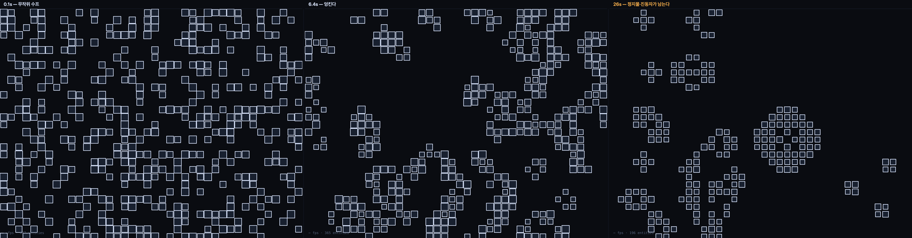
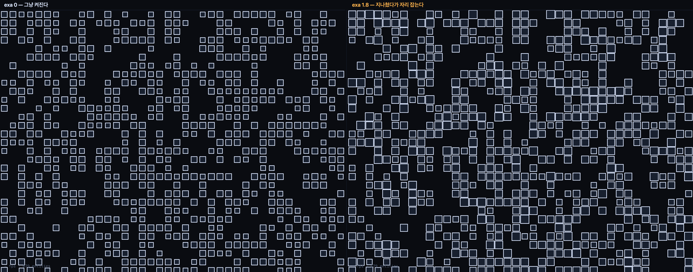

# 006 · 라이프 게임 — 깜빡임을 움직임으로

`math` · `steady` · 2026-08-24

```
Life(B3/S23)@flock + Pop(생멸→scale)@deform ×exa1.8
https://kinesynth.vercel.app/?demo=life
```



## 원리 한 줄

이웃이 둘이나 셋이면 살고, 셋이면 태어난다 — 그것뿐인데 활공체가 생긴다.

## 규칙이 맞는지부터

CA는 눈으로 맞는지 알 수 없다. 그럴싸해 보이는 것과 B3/S23인 것은 다르다.
**독립 구현을 하나 더 써서 대조했다** — 같은 초기 상태에서 40세대를 돌려 살아 있는 칸의 집합을 비교.

```
 1세대  코어 647칸  참조 647칸  ✓
 …
40세대  코어 228칸  참조 228칸  ✓
40세대 중 불일치 0건
```

정지물(블록)·진동자(블링커)도 기대값을 손으로 적지 않고 참조 구현으로 만들어 대조했다.
처음엔 손으로 적었다가 **하네스가 한 세대 어긋나 있었다** — `period`와 `dt`가
부동소수로 딱 안 떨어져서 `seek(period)`가 0세대 또는 1세대를 돌았다.
코어가 아니라 시험 쪽이 틀린 것이었는데, 손으로 적은 기대값으로는 구별이 안 됐다.

## 이웃 탐색에 탐색이 없다

`core/grid.ts`(이웃 격자)를 쓰지 않았다. 그건 "연속 좌표에서 반경 r 안에 누가 있나"를
답하는 물건이고, 라이프가 묻는 건 **"격자 자리 (i,j)에 무엇이 있나"**다.
칸이 곧 색인이라 8이웃은 O(1) 조회 — 탐색 자체가 없다.

> 질문이 다르면 색인도 다르다. 있는 도구를 쓰는 게 늘 옳은 건 아니다.

탄생 후보도 전체 칸을 훑지 않는다. **살아 있는 칸의 빈 이웃 자리**만 후보이고,
세대 번호를 도장처럼 찍어 중복을 막는다(배열을 비울 필요가 없다). 비용은 살아 있는 칸 수에 비례한다.
1200칸 판에 400세포가 살아도 **0.006 ms/step**.

## 낙차가 들어오는 문

라이프는 본질적으로 깜빡이는 이산 시스템이다. 그대로 그리면 움직임이 아니라 점멸이다.

**논리는 이산, 움직임은 연속으로 갈랐다.** 세대는 `period`(0.3초)마다 한 번 넘어가지만
`sig.age`(태어난 뒤 0→1)와 `sig.fade`(사라지는 중 0→1)는 매 프레임 흐른다.
죽은 칸을 즉시 지우지 않는 게 핵심이다 — **수축을 그릴 프레임이 있어야 한다.**
`fade`가 다 차야 despawn한다.

그리고 그 신호를 **deform 코어가 읽는다**. `Life`는 규칙만 말하고 낙차는 합성으로 들어온다.

| exa | 최대 scale | 보이는 것 |
|---|---|---|
| 0 | 1.000 | 그냥 켜지고 꺼진다 = 이산 시스템 그대로 |
| 1 | 1.100 | 살짝 지나친다 |
| **1.8** | **1.258** | 지나쳤다가 자리 잡는다 |
| 3 | 1.527 | 만화 |



`Pop`은 신호만 읽으므로 라이프 전용이 아니다. `sig.age`/`sig.fade`를 쓰는 어떤 코어에도 걸린다.
살아 있는 동안의 아주 느린 맥동(숨)도 얹는데, 위상을 **엔티티 id에서** 뽑아 세포마다 어긋나게 했다 —
안 그러면 판 전체가 한 박자로 뛴다.

## 이어지는 질문

- **규칙을 바꿀 수 없다.** B3/S23이 박혀 있다. `ParamDef`가 숫자만 받아서 규칙 문자열을 못 싣는다 —
  앵커를 패치로 옮겨 풀었던 것과 같은 한계가 또 나왔다. W2에서 "규칙을 바꾸면 뭐가 되나"를
  하려면 이걸 풀어야 한다. **파라미터 모델의 다음 질문.**
- 활공체가 화면을 가로지르는 걸 따로 보여 주고 싶다. 지금은 무작위 수프뿐이라
  초기 패턴을 손으로 놓을 방법이 없다.
